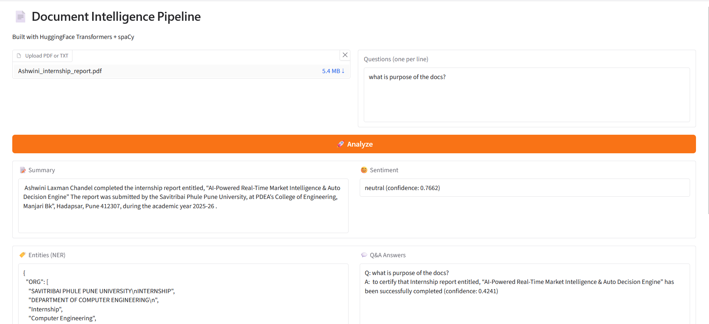

# 📄 Document Intelligence Pipeline

🚀 An end-to-end NLP-powered system for analyzing documents (PDF/TXT) built for the RocketRide AI Internship.

---

## 🔥 Features

* 📂 Document Loader (PDF/TXT)
* ✂️ Text Chunking
* 🧠 Summarization (DistilBART)
* 😊 Sentiment Analysis (RoBERTa)
* 🏷️ Named Entity Recognition (spaCy)
* ❓ Question Answering (RoBERTa SQuAD2)

---

## 🧱 Architecture

```
[Document]
     ↓
[Text Chunking]
     ↓
 ┌───────────────┬───────────────┬───────────────┬───────────────┐
 │ Summarizer    │ Sentiment     │ NER           │ QA            │
 │               │ Analyzer      │ Extractor     │ Chatbot       │
 └───────────────┴───────────────┴───────────────┴───────────────┘
     ↓
[Final Output]
```

---

## 📸 Demo Screenshot



---

## 🚀 Live Demo

👉 Temporary demo (may expire):
[https://f5a22b668fbafbf895.gradio.live](https://f5a22b668fbafbf895.gradio.live)

---

## 🛠️ Tech Stack

* Python 3.13
* HuggingFace Transformers
* PyTorch
* spaCy
* Gradio

---

## 📂 Project Structure

```
pipeline/
  nodes/
    document_loader/
    text_chunker/
    summarizer/
    sentiment_analyzer/
    entity_extractor/
    qa_chatbot/
  pipeline.py

demo/
  app.py

pipelines/
  document_intelligence.json
```

---

## ⚠️ Known Issues

* QA model may return low-confidence answers for vague questions
* Extractive QA depends on exact context match

---

## ▶️ How to Run

```bash
cd D:\document-intelligence-pipeline
venv\Scripts\activate
python demo/app.py
```

---

## 📌 Future Improvements

* Improve QA using Retrieval-Augmented Generation (RAG)
* Add multi-document support
* Enhance UI for better user experience

---

## 👨‍💻 Author

**Tejesh Yewale**

---

⭐ If you like this project, consider giving it a star!
